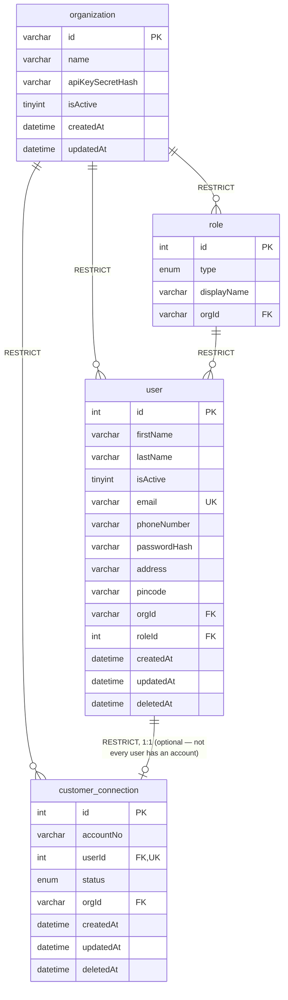
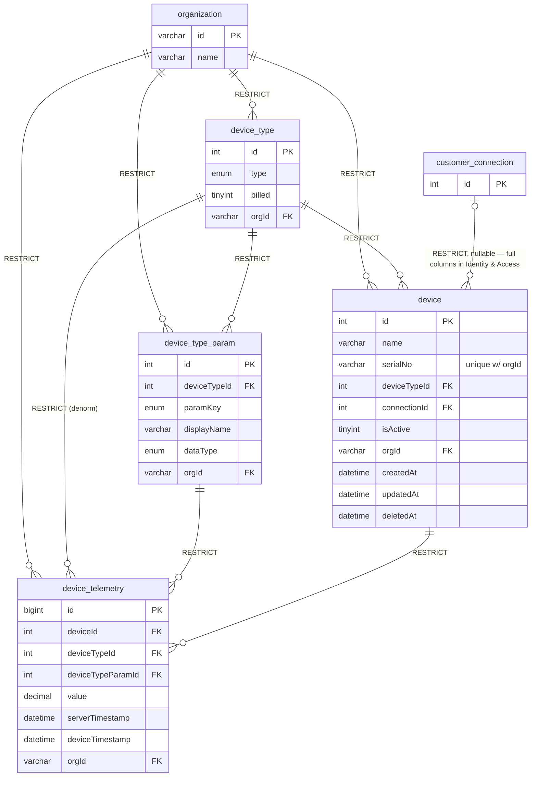
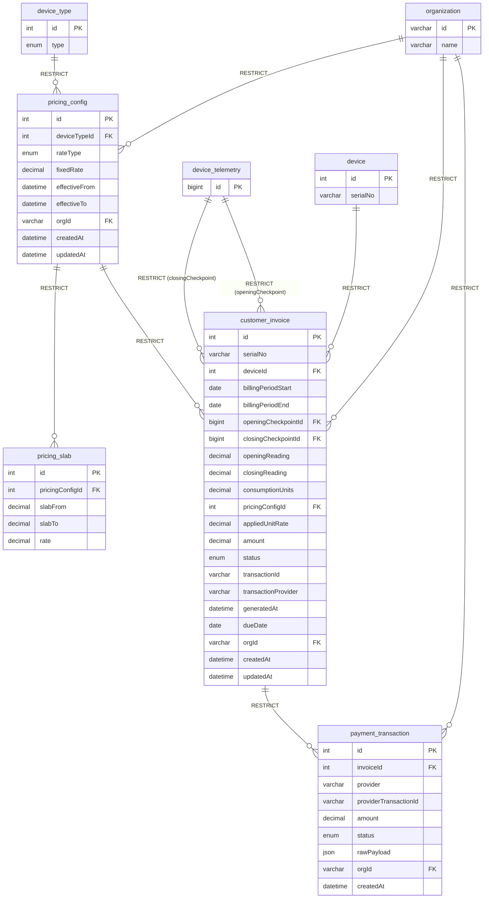

# Database Tables

## Table Overview

All 12 tables are MySQL 8 tables managed by TypeORM, one migration per table (`backend/src/database/migrations/`, plus 2 later index-only migrations). Every foreign key uses `ON DELETE RESTRICT` — soft delete is used on the three mutable/entity tables instead of cascading or nulling deletes, so a hard `DELETE` on a still-referenced row fails loudly rather than corrupting history. `synchronize` is always `false`; migrations are the only source of truth. Source: `../../ubiqedge_tech_data_model`.

## Core Tables

### organization

Tenancy root. `id` is human-readable (e.g. `ORG01`) and doubles as the ingestion URI's `:orgCode` — not a surrogate key.

| Column           | Type         | Constraints             | Description                                                    |
| ------------------| --------------| --------------------------| --------------------------------------------------------------------|
| id               | varchar(32)  | PK                       | Human-readable org code                                          |
| name             | varchar(255) | NOT NULL                 | Display name                                                    |
| apiKeySecretHash | varchar(64)  | NULLABLE                 | SHA-256 hex digest of the org's ingestion API key (not bcrypt — see Notes) |
| isActive         | tinyint      | NOT NULL, default 1      | —                                                                |
| createdAt        | datetime(6)  | NOT NULL                 | —                                                                |
| updatedAt        | datetime(6)  | NULLABLE                 | —                                                                |

---

### role

| Column      | Type         | Constraints         | Description                    |
| ------------| --------------| ----------------------| -----------------------------------|
| id          | int (PK)     | AUTO_INCREMENT       | —                              |
| type        | enum         | NOT NULL              | `Admin` \| `Customer`          |
| displayName | varchar(255) | NOT NULL              | —                              |
| orgId       | varchar(32)  | FK → organization, RESTRICT | —                        |

**Unique**: `(type, orgId)`

---

### user

| Column       | Type         | Constraints                          | Description                                     |
| -------------| --------------| ---------------------------------------| ----------------------------------------------------|
| id           | int (PK)     | AUTO_INCREMENT                        | —                                                |
| firstName    | varchar(255) | NOT NULL                              | —                                                |
| lastName     | varchar(255) | NULLABLE                              | —                                                |
| isActive     | tinyint      | NOT NULL, default 1                   | —                                                |
| email        | varchar(255) | NOT NULL, **UNIQUE (global)**         | Not per-org — login has no orgCode, see Notes    |
| phoneNumber  | varchar(32)  | NOT NULL                              | —                                                |
| passwordHash | varchar(255) | NOT NULL                              | bcrypt, 10 rounds                                |
| address      | varchar(255) | NOT NULL                              | —                                                |
| pincode      | varchar(16)  | NOT NULL                              | —                                                |
| orgId        | varchar(32)  | FK → organization, RESTRICT           | Denormalized                                     |
| roleId       | int          | FK → role, RESTRICT                   | —                                                |
| createdAt    | datetime(6)  | NOT NULL                              | —                                                |
| updatedAt    | datetime(6)  | NULLABLE                              | —                                                |
| deletedAt    | datetime(6)  | NULLABLE                              | Soft delete                                      |

---

### customer_connection

The FR's "account" — 1:1 with `user`.

| Column    | Type         | Constraints                    | Description                                    |
| ----------| --------------| ---------------------------------| ---------------------------------------------------|
| id        | int (PK)     | AUTO_INCREMENT                 | —                                               |
| accountNo | varchar(64)  | NOT NULL                       | Auto-generated from own id (`ORG01-000001`)     |
| userId    | int          | FK → user, RESTRICT, **UNIQUE** | Enforces the 1:1                                |
| status    | enum         | NOT NULL, default `ACTIVE`     | `ACTIVE` \| `SUSPENDED`                          |
| orgId     | varchar(32)  | FK → organization, RESTRICT    | Denormalized                                    |
| createdAt | datetime(6)  | NOT NULL                       | —                                               |
| updatedAt | datetime(6)  | NULLABLE                       | —                                               |
| deletedAt | datetime(6)  | NULLABLE                       | Soft delete                                     |

**Unique**: `(accountNo, orgId)`, `(userId)`

---

### device_type

| Column | Type    | Constraints                 | Description                                          |
| -------| ---------| ------------------------------| ---------------------------------------------------------|
| id     | int (PK)| AUTO_INCREMENT               | —                                                     |
| type   | enum    | NOT NULL                     | `TANK` \| `METER`                                     |
| billed | tinyint | NOT NULL, default 0          | METER=1, TANK=0 — a flag, not a hardcoded type check   |
| orgId  | varchar(32) | FK → organization, RESTRICT | —                                                  |

**Unique**: `(type, orgId)`

---

### device_type_param

Which telemetry parameters exist per org. `paramKey` is immutable once created.

| Column       | Type         | Constraints                     | Description                       |
| -------------| --------------| ----------------------------------| ---------------------------------------|
| id           | int (PK)     | AUTO_INCREMENT                  | —                                  |
| deviceTypeId | int          | FK → device_type, RESTRICT       | —                                  |
| paramKey     | enum         | NOT NULL                        | `LEVEL` \| `TOTAL` \| `FLOW`       |
| displayName  | varchar(255) | NOT NULL                        | —                                  |
| dataType     | enum         | NOT NULL, default `numeric`     | —                                  |
| orgId        | varchar(32)  | FK → organization, RESTRICT      | Denormalized                       |

**Unique**: `(paramKey, orgId)` — one paramKey per org, regardless of which device type it belongs to.

---

### device

Meter or tank.

| Column       | Type         | Constraints                        | Description                                                     |
| -------------| --------------| --------------------------------------| ----------------------------------------------------------------------|
| id           | int (PK)     | AUTO_INCREMENT                      | —                                                              |
| name         | varchar(255) | NOT NULL                            | —                                                              |
| serialNo     | varchar(64)  | NOT NULL                            | Auto-generated from own id (`ORG01-METER-000001`)               |
| deviceTypeId | int          | FK → device_type, RESTRICT          | —                                                              |
| connectionId | int          | FK → customer_connection, RESTRICT, **NULLABLE** | Admin can add to inventory before assigning to an account |
| isActive     | tinyint      | NOT NULL, default 1                 | —                                                              |
| orgId        | varchar(32)  | FK → organization, RESTRICT         | Denormalized                                                   |
| createdAt    | datetime(6)  | NOT NULL                            | —                                                              |
| updatedAt    | datetime(6)  | NULLABLE                            | —                                                              |
| deletedAt    | datetime(6)  | NULLABLE                            | Soft delete — ingestion-service excludes soft-deleted devices  |

**Unique**: `(serialNo, orgId)`

---

### device_telemetry

Append-only reading stream, written exclusively by `ingestion-service` (see `../../ingestion-service/docs/db-tables.md`).

| Column            | Type         | Constraints                          | Description                              |
| -------------------| --------------| ---------------------------------------| ----------------------------------------------|
| id                | bigint (PK)  | AUTO_INCREMENT                       | —                                          |
| deviceId          | int          | FK → device, RESTRICT                | —                                          |
| deviceTypeId      | int          | FK → device_type, RESTRICT           | Denormalized                              |
| deviceTypeParamId | int          | FK → device_type_param, RESTRICT     | —                                          |
| value             | decimal(18,4)| NOT NULL                             | —                                          |
| serverTimestamp   | datetime     | NOT NULL                             | Set by ingestion-service = receipt time    |
| deviceTimestamp   | datetime     | NOT NULL                             | From payload = actual reading time         |
| orgId             | varchar(32)  | FK → organization, RESTRICT          | Denormalized                              |

**Unique**: `(orgId, deviceId, deviceTypeParamId, deviceTimestamp)` — `orgId` leads deliberately, so this same index serves both the ingestion write path's duplicate-key idempotency check *and* tenant-scoped time-window scans for the consumption view. See `implementation-spec.md` for how this index shape was chosen.

---

### pricing_config

Only one row per `(orgId, deviceTypeId)` may be active (`effectiveTo IS NULL`) at a time — enforced at the application layer, not a DB constraint.

| Column        | Type          | Constraints                     | Description                                  |
| ---------------| ---------------| -----------------------------------| ---------------------------------------------------|
| id            | int (PK)      | AUTO_INCREMENT                   | —                                             |
| deviceTypeId  | int           | FK → device_type, RESTRICT        | billed=true type only (meter)                 |
| rateType      | enum          | NOT NULL                         | `FIXED` \| `SLAB`                             |
| fixedRate     | decimal(12,4) | NULLABLE                         | Used when rateType=FIXED                       |
| effectiveFrom | datetime      | NOT NULL                         | —                                             |
| effectiveTo   | datetime      | NULLABLE                         | `null` = currently active                     |
| orgId         | varchar(32)   | FK → organization, RESTRICT       | —                                             |
| createdAt     | datetime(6)   | NOT NULL                         | —                                             |
| updatedAt     | datetime(6)   | NULLABLE                         | —                                             |

**Index**: `(deviceTypeId, orgId, effectiveTo)` — the "find the active config" lookup, hit on every `GET /pricing-configs/active` call and once per device inside every invoice-generation batch loop (added after the initial build, once real query patterns were known — see `implementation-spec.md`).

---

### pricing_slab

Child rows of a `pricing_config` where `rateType = SLAB`.

| Column          | Type          | Constraints                        | Description                     |
| -----------------| ---------------| --------------------------------------| ------------------------------------|
| id              | int (PK)      | AUTO_INCREMENT                      | —                                |
| pricingConfigId | int           | FK → pricing_config, RESTRICT        | —                                |
| slabFrom        | decimal(12,4) | NOT NULL                            | Inclusive lower bound            |
| slabTo          | decimal(12,4) | NULLABLE                            | `null` = unbounded (last tier)   |
| rate            | decimal(12,4) | NOT NULL                            | Per-unit rate for this tier      |

**Unique**: `(pricingConfigId, slabFrom)`

---

### customer_invoice

One row per device per billing period.

| Column              | Type          | Constraints                            | Description                                      |
| ---------------------| ---------------| ------------------------------------------| -------------------------------------------------------|
| id                  | int (PK)      | AUTO_INCREMENT                          | —                                                  |
| serialNo            | varchar(64)   | NOT NULL                                | Auto-generated invoice number                       |
| deviceId            | int           | FK → device, RESTRICT                    | —                                                  |
| billingPeriodStart  | date          | NOT NULL                                | —                                                  |
| billingPeriodEnd    | date          | NOT NULL                                | —                                                  |
| openingCheckpointId | bigint        | FK → device_telemetry, RESTRICT          | Last invoice's closing checkpoint, or earliest telemetry |
| closingCheckpointId | bigint        | FK → device_telemetry, RESTRICT          | Latest TOTAL reading at/before period end            |
| openingReading      | decimal(18,4) | NOT NULL                                | Copied from openingCheckpoint.value                  |
| closingReading      | decimal(18,4) | NOT NULL                                | Copied from closingCheckpoint.value                  |
| consumptionUnits    | decimal(18,4) | NOT NULL                                | = closingReading - openingReading, denormalized      |
| pricingConfigId     | int           | FK → pricing_config, RESTRICT            | Audit: which config was applied                      |
| appliedUnitRate     | decimal(12,4) | NOT NULL                                | Blended effective rate actually charged              |
| amount              | decimal(12,2) | NOT NULL                                | = consumptionUnits * appliedUnitRate, or slab-computed |
| status              | enum          | NOT NULL, default `PENDING`             | `PENDING` \| `PAID` \| `CANCELLED`                    |
| transactionId       | varchar(255)  | NULLABLE                                | Set on PAID                                          |
| transactionProvider | varchar(64)   | NULLABLE                                | Set on PAID                                          |
| generatedAt         | datetime      | NOT NULL                                | —                                                    |
| dueDate             | date          | NULLABLE                                | —                                                    |
| orgId               | varchar(32)   | FK → organization, RESTRICT              | Denormalized                                         |
| createdAt           | datetime(6)   | NOT NULL                                | —                                                    |
| updatedAt           | datetime(6)   | NULLABLE                                | —                                                    |

**Unique**: `(deviceId, billingPeriodStart, billingPeriodEnd)` — prevents double-generation; this is the idempotency guarantee for the batch job.

**Index**: `(orgId, generatedAt)` — `findAll`/`findMine`'s org-scoped, paginated, `ORDER BY generatedAt DESC` list screens, which only get more expensive as invoices accumulate month over month (added after the initial build, same batch as the pricing_config index above).

**Note — not soft-deletable.** Unlike `user`/`customer_connection`/`device`, financial records use the `CANCELLED` status instead of a delete, to preserve a complete audit trail.

**Note — opening checkpoint anchor query** (batch generation, per device):

```sql
SELECT closingCheckpointId, closingReading, billingPeriodEnd
FROM customer_invoice
WHERE deviceId = ? AND status != 'CANCELLED'
ORDER BY billingPeriodEnd DESC
LIMIT 1
```

Filters out `CANCELLED` but not `PENDING` vs `PAID` — payment status must never affect consumption continuity, only whether the invoice row was actually created. If no row is found (first invoice ever), falls back to the device's earliest `device_telemetry` row for its `TOTAL` param. If the last invoice's `billingPeriodEnd` is more than one period back (a prior run was skipped), the new invoice's `billingPeriodStart` becomes that old `billingPeriodEnd`, so the invoice implicitly spans the gap rather than losing or double-counting consumption.

---

### payment_transaction

One row per payment attempt.

| Column                | Type          | Constraints                     | Description                     |
| -----------------------| ---------------| -----------------------------------| -------------------------------------|
| id                    | int (PK)      | AUTO_INCREMENT                   | —                                |
| invoiceId             | int           | FK → customer_invoice, RESTRICT   | —                                |
| provider              | varchar(64)   | NOT NULL                         | e.g. `mock`                      |
| providerTransactionId | varchar(255)  | NOT NULL                         | Provider's own transaction id     |
| amount                | decimal(12,2) | NOT NULL                         | —                                |
| status                | enum          | NOT NULL                         | `INITIATED` \| `SUCCESS` \| `FAILED` |
| rawPayload            | json          | NULLABLE                         | Webhook payload, kept for audit  |
| orgId                 | varchar(32)   | FK → organization, RESTRICT       | Denormalized                     |
| createdAt             | datetime(6)   | NOT NULL                         | —                                |

**Unique**: `(provider, providerTransactionId)` — the idempotency guarantee for webhook processing.

**Note — not soft-deletable**, same rationale as `customer_invoice`.

---

## Stretch Tables (not built)

Documented in the data model but not implemented — appreciated/stretch scope, only built if core scope + tests were solid first (they were not reached):

### device_command (relay-based supply cutoff)

`id, deviceId (FK), command (SUPPLY_ON|SUPPLY_OFF), status (PENDING|ACKED), issuedAt, ackedAt, orgId (FK)`

### webhook_subscription (outbound webhook egress)

`id, eventType (INVOICE_GENERATED|PAYMENT_COMPLETED|TELEMETRY_RECEIVED), targetUrl, secret, isActive, orgId (FK), createdAt`

---

## Enum Definitions

### RoleType

| Value    | Description |
| ---------| --------------|
| Admin    | —          |
| Customer | —          |

### ConnectionStatus

| Value     | Description                              |
| ----------| ---------------------------------------------|
| ACTIVE    | Normal service                          |
| SUSPENDED | Supply cutoff applied for non-payment    |

### DeviceTypeEnum

| Value | Description |
| -------| --------------|
| TANK  | —          |
| METER | —          |

### ParamKey

| Value | Description                     |
| -------| ------------------------------------|
| LEVEL | Tank water level                |
| TOTAL | Meter cumulative consumption     |
| FLOW  | Meter instantaneous flow rate    |

### RateType

| Value | Description                       |
| -------| --------------------------------------|
| FIXED | Flat rate per consumption unit     |
| SLAB  | Progressive tiered rate            |

### InvoiceStatus

| Value     | Description                                 |
| ----------| --------------------------------------------------|
| PENDING   | Generated, awaiting payment                  |
| PAID      | Payment webhook confirmed success            |
| CANCELLED | Admin voided (e.g. bad reading), terminal    |

### PaymentStatus

| Value     | Description                    |
| ----------| ------------------------------------|
| INITIATED | Session created, awaiting webhook |
| SUCCESS   | Webhook confirmed success       |
| FAILED    | Webhook confirmed failure       |

---

## Entity Relationship Diagrams

Split into three diagrams by domain, so each stays readable as an entity-attribute diagram rather than one large relationship-only graph. `organization` is denormalized onto almost every other table (`orgId`), so it's shown with its full columns once (Identity & Access) and as a minimal PK-only anchor everywhere else — same treatment for any other entity that's the *target* of a cross-domain FK but owned by a different diagram (e.g. `device_type`/`device`/`device_telemetry` reappear as stubs in Billing & Payments). Columns and keys below are verified against the tables above; types are simplified (e.g. `decimal(18,4)` → `decimal`) for diagram readability only — see the per-table sections for exact precision/length.

### Identity & Access



`role.type` and `device_type.type` etc. use composite uniqueness (`(type, orgId)`), not a standalone `UK` — only columns with a true single-column unique constraint (`user.email`, `customer_connection.userId`) are marked `UK` here; see the per-table **Unique** notes above for the composite ones.

### Device & Telemetry



`device_telemetry` has no `createdAt`/`updatedAt` — it's an append-only stream; `serverTimestamp`/`deviceTimestamp` are its only time columns.

### Billing & Payments



`device_telemetry` relates to `customer_invoice` via two separate foreign keys (`openingCheckpointId`, `closingCheckpointId`), both pointing at the same table — shown above as two edges. `pricing_slab` has no `orgId` column — it's scoped indirectly through `pricingConfigId`, so it isn't a direct `organization` child in this diagram.

## Indexes

- All primary keys indexed automatically; MySQL/InnoDB also auto-creates a supporting index per FK column unless a composite index already covers it as a leftmost prefix (see the `pricing_config`/`customer_invoice` migration notes below).
- `device_telemetry(orgId, deviceId, deviceTypeParamId, deviceTimestamp)` — unique, serves both idempotent-write duplicate detection and consumption-view range scans.
- `pricing_config(deviceTypeId, orgId, effectiveTo)` — active-config lookup, added post-launch once query patterns were known (migration `1700000000013`).
- `customer_invoice(orgId, generatedAt)` — invoice list screens, added post-launch (migration `1700000000014`).
- **Migration gotcha worth noting**: adding either composite index above caused InnoDB to silently repurpose it as the sole supporting index for that table's leading-column FK, so a later `DROP INDEX` failed with `ER_DROP_INDEX_FK` until the migration's `down()` explicitly recreated the original single-column FK-support index first. Both migrations were validated with a full run → revert → run cycle before being treated as final.
- Deliberately *not* indexed further: read-light admin config screens (`user`, `device` list pagination) — bounded by physical inventory size, not unbounded growth like `customer_invoice`, so a filesort over a few hundred rows was judged not worth the extra write-side index cost.

## Notes

- `apiKeySecretHash` uses SHA-256, not bcrypt — the key is a high-entropy random secret, not a user-chosen password, so slow hashing buys no brute-force resistance and only adds latency to every ingest call.
- `user.email` is globally unique, not per-org — `POST /auth/login` has no `orgCode`, so email alone must resolve unambiguously to one user across every organization.
- Soft delete (`@DeleteDateColumn`) is used on `user`, `customer_connection`, `device` only. `customer_invoice` and `payment_transaction` are financial records and use status fields (`CANCELLED`) instead, to preserve a complete, unaltered audit trail.
- All FK relations use `RESTRICT`, deliberately — since soft delete is in play elsewhere, a hard `DELETE` on a still-referenced row must fail loudly, not cascade or silently null out a reference.
