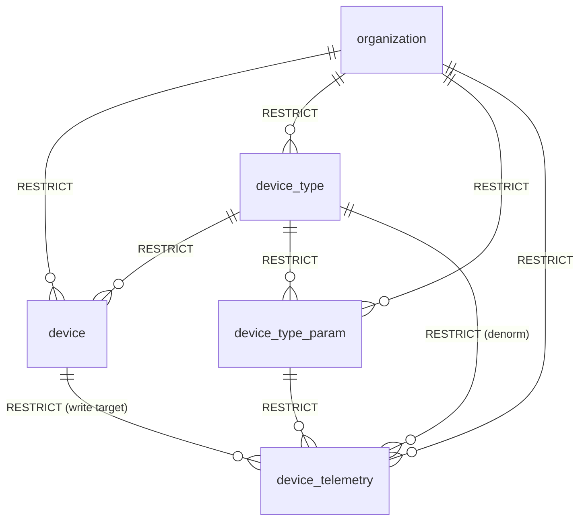

# Database Tables

## Table Overview

`ingestion-service` owns no tables — it does not define entities, run migrations, or hold schema authority over anything. It connects to the same MySQL database `backend` manages, via a separate raw `mysql2` pool, and touches exactly 5 of `backend`'s 12 tables: 4 read-only lookups plus 1 append-only write target. Full column definitions, constraints, and migration history for all 12 tables live in `../../backend/docs/db-tables.md` — this file documents only how *this* service uses the 5 it touches. Source: `../../ubiqedge_tech_data_model`.

## Tables Touched — Relationships



Read-only lookups: `organization`, `device`, `device_type`, `device_type_param`. Write target (append-only, idempotent insert): `device_telemetry`. All five are owned and migrated exclusively by `backend` — see `../../backend/docs/db-tables.md` for the full 12-table schema and every other table's relationships.

## Tables Touched

### organization (read-only)

Used by `ApiKeyGuard` to resolve `:orgCode` and fetch `apiKeySecretHash` for the timing-safe key comparison. See `../../backend/docs/db-tables.md#organization` for full columns.

```sql
SELECT id, apiKeySecretHash FROM organization WHERE id = ? AND isActive = 1
```

### device (read-only)

Used by `IngestService` to resolve `(orgId, serialNo)` to a device, check its type against the `:deviceType` path segment, and check `connectionId IS NOT NULL` (the linkage gate). See `../../backend/docs/db-tables.md#device`.

```sql
SELECT id, deviceTypeId, connectionId
FROM device
WHERE orgId = ? AND serialNo = ? AND deletedAt IS NULL
```

Soft-deleted devices (`deletedAt IS NOT NULL`) are excluded — a removed device cannot receive new telemetry even if a stale physical unit keeps transmitting.

### device_type (read-only)

Used to confirm the resolved device's actual type matches the `:deviceType` path segment. See `../../backend/docs/db-tables.md#device_type`.

### device_type_param (read-only)

Used to validate every reading's `paramKey` is configured for the resolved device's type before any write proceeds. See `../../backend/docs/db-tables.md#device_type_param`.

```sql
SELECT id FROM device_type_param
WHERE deviceTypeId = ? AND paramKey = ? AND orgId = ?
```

Checked once per reading in the request; all must resolve before any `device_telemetry` insert runs (see `technical-specifications.md` — Ingestion Processing Flow).

### device_telemetry (write, append-only)

The sole table this service writes to. Full column list in `../../backend/docs/db-tables.md#device_telemetry`; the relevant shape for this service's insert:

```sql
INSERT INTO device_telemetry
  (deviceId, deviceTypeId, deviceTypeParamId, value, serverTimestamp, deviceTimestamp, orgId)
VALUES (?, ?, ?, ?, ?, ?, ?)
```

- `serverTimestamp` is set by this service at receipt time (`new Date()`), not taken from the request.
- `deviceTimestamp` is taken directly from the request body, converted to a `Date`.
- The unique constraint `(orgId, deviceId, deviceTypeParamId, deviceTimestamp)` is what makes this insert idempotent — a duplicate delivery raises `ER_DUP_ENTRY`, which `IngestService` catches and treats as a successful no-op rather than an error (see `technical-specifications.md` — Idempotency Design).

## Why No Local Schema Copy

Duplicating `backend`'s entity/migration definitions here would create two sources of truth for the same tables. Instead, this service treats the schema as an external contract: it reads/writes with hand-written parameterized SQL against column names it does not own, and any schema change on `backend`'s side (e.g. a renamed column) must be coordinated across both services manually. This is a deliberate simplification appropriate to a service this narrow in scope — see `technical-specifications.md` for the fuller rationale on skipping an ORM here.

## Notes

- All 5 tables above are organization-scoped (`orgId` column or equivalent); this service always filters by the `:orgCode` path parameter's resolved `orgId`, never a client-supplied one.
- This service never migrates, creates, or alters any table. `backend`'s migration workflow (see `../../backend/docs/technical-specifications.md`) is the only place schema changes happen.
